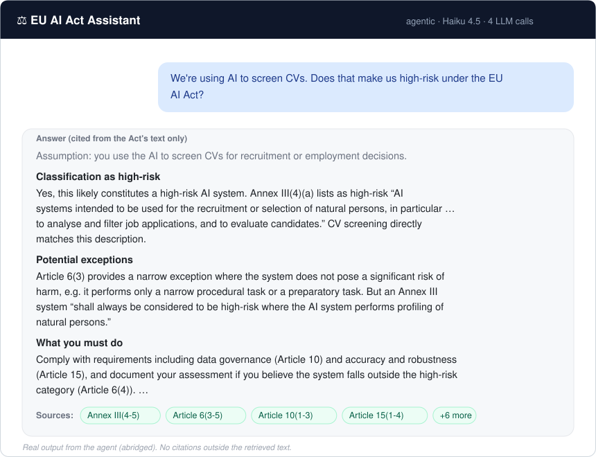
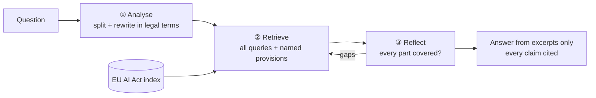

# EU AI Act Assistant

### Can an AI answer compliance questions *and* know when it doesn't know?

Picture a product manager asking:

> *"We're using AI to screen CVs. Does that make us high-risk under the EU AI Act?"*

The answer is spread across three parts of a 144-page law: Annex III, Article 6 and
Article 26. A general chatbot answers confidently, and sometimes it cites the wrong
article. In compliance, a confident wrong answer is worse than no answer.

So I built an assistant that answers **only from the law**, cites a source for every
claim, and refuses when the law doesn't cover the question. This repo is the whole
journey, run the way I'd run an AI feature as a PM:
1. Decide what "good" means first.
2. Measure every change against it.
3. Never ship on vibes.



---

## 🎯 Four KPIs, in priority order

| KPI | Target | Shipped | Status | Why this bar |
|---|---|---|---|---|
| **1. Groundedness**: never invent | ≥ 0.95 | **0.98** | ✅ | An invented obligation is the most dangerous failure, because someone might act on it. It isn't 1.00 because LLM judges wobble, so I review every flagged answer by hand. |
| **2. Correct refusals**: don't bluff | 100% | **100%** | ✅ | Bluffing once destroys trust, so this is a hard gate, not an average. |
| **3. Correctness** | ≥ 0.90 | **0.93** | ✅ | This is only worth something once 1 and 2 hold. At 9 in 10, people trust it for first-pass research. |
| **4. Cost per question** | ≤ $0.03 | **$0.022** | ✅ | Keeps it viable, and stops me "buying" quality with the biggest model. |

*All four are scored on a 41-question test set I wrote by hand. Scores come from LLM
judges, and I review every answer the judges fail.*

---

## 📖 How it got there

- **Started simple.** Basic RAG got **63%** right, and it refused 1 in 4 questions it
  *could* have answered.
- **Went deep on chunking and retrieval**, which is where most of my time went:
  - Split the law along its real structure (articles, paragraphs, definitions,
    annexes) instead of arbitrary text windows.
  - Tag every chunk with its chapter and section.
  - When a question names "Article 97", look that article up directly.
- **Fixed a cautious prompt.** One line, *"when in doubt, refuse"*, was blocking answers
  the evidence supported. Rewriting it cut wrong refusals **from 10 to 4**.
- **Made retrieval smarter, not just the model.** People say "CV screening", and the law
  says "recruitment or selection of natural persons". So the agent rewrites the question
  into legal language, splits it into parts, and searches again until every part is
  covered. Sources found went **from 39 to 47 out of 61**, with the same answering model
  throughout.
- **My own release gate blocked it.** The agent answered 2 questions labelled "should
  refuse", so I didn't ship it. On review, the law *does* answer them, so I relabelled
  them, re-ran everything and fixed a separate bug before shipping. The
  [case study](docs/case-study.md) keeps that sequence visible on purpose.

## ⚖️ Three ways to answer

| | 💨 Basic RAG (first version) | 🧠 Agent (shipped) | 🔨 Whole law sent to Opus 5.5 |
|---|---|---|---|
| 1. Groundedness (≥ 0.95) | 1.00\* | **0.98** ✅ | 0.93 ❌ |
| 2. Correct refusals (100%) | 100% ✅ | 100% ✅ | 100% ✅ |
| 3. Correctness (≥ 0.90) | 0.63 ❌ | 0.93 ✅ | **0.98** ✅ |
| 4. Cost per question (≤ $0.03) | **$0.003** ✅ | $0.022 ✅ | $0.086 ❌ |
| Answerable questions wrongly refused | 11 of 37 | **0** | **0** |
| Time per answer | **4 s** | 15 s | 17 s |

\* Inflated: the 11 wrong refusals count as "grounded", because a refusal can't invent
anything.

Only the agent passes all four KPIs. It gets within 2 questions of brute force on
correctness for about a quarter of the price. Its weak spot is speed.

*Scoring: the first basic RAG was scored by hand, the agent by LLM judge plus my
review, and Opus by LLM judge only.*

## 💡 What I learned

- **Garbage in, garbage out.** With the same answering model (Haiku 4.5) throughout,
  better chunking and retrieval took correctness from 0.63 to 0.93. That's why I spent
  most of my time there. The one big jump that didn't come from retrieval was fixing
  the over-cautious refusal prompt. A stronger model can compensate, but at 4× the cost:
  giving Opus 5.5 the whole law scores 0.98.
- **A perfect metric can hide a bad product.** Groundedness scored 100% while the
  assistant refused 1 in 4 answerable questions, because a refusal can't invent
  anything.
- **Write the ship rule before you see the results.** Otherwise every result looks like
  a reason to ship.
- **LLM judges wobble.** One run isn't a trend, so a human reviews what the judge flags.

## 🚀 What I'd do next to perfect it

1. **Build a web UI.** Add clickable citations that open the source text, show the
   agent's assumptions, give refusals a clear state, and add thumbs-up/down feedback.
   That's also what makes step 2 possible.
2. **Test with real users.** Run a pilot with a compliance team, collect thumbs-up and
   thumbs-down on answers, and track a true product KPI: the share of questions resolved
   without escalating to legal.
3. **Strengthen the test set.** 41 questions is small, and "100% correct refusals" rests
   on only 2 questions. I'd grow it to 100+ questions, with at least 15 that should be
   refused.
4. **Make it faster.** Target under 8 seconds by running stages in parallel, using a
   smaller model for the self-check, and skipping steps for simple lookups.
5. **Get stable numbers.** Average 3 eval runs per change so judge wobble can't decide a
   release, and run the eval automatically on every prompt or retrieval change.
6. **Run a fair benchmark.** Test the strongest model *with* retrieval, to separate how
   much of the gap comes from the model and how much from the search.
7. **Keep it current.** Add the Commission's guidance documents, and version the index
   so answers say which version of the law and guidance they came from.

---

## 🔧 Under the hood



- **Models:** Claude Haiku 4.5 answers, and Claude Sonnet 5 judges (a different model,
  so nothing grades its own work).
- **Stack:** bge-small embeddings, Chroma, and LangSmith for traces and evaluations.
- **Built-in limits:** at most 5 model calls per question, and follow-ups only for
  provisions named in the retrieved text.

**Run it:**

```bash
pip install -r requirements.txt && cp .env.example .env   # add OPENROUTER_API_KEY
# save the Act from EUR-Lex (Regulation (EU) 2024/1689) as data/eu_ai_act.pdf
python ingest.py --reset      # build the index
python query.py               # ask questions (add --baseline for basic RAG)
python run_all_evals.py --system agentic --concurrency 2   # full evaluation
```

Link to the Act on EUR-Lex:
[Regulation (EU) 2024/1689](https://eur-lex.europa.eu/eli/reg/2024/1689/oj).

**Read more:**
- **[Case study](docs/case-study.md):** every experiment, the release gate, the
  failures, and the trade-offs.
- **[Decision log](docs/decision-log.md):** each change as hypothesis, result and
  decision.
- **[Metrics](docs/metrics.md):** how each metric is defined.
- **[`plans/`](plans/):** the plan written before each change.
- **[`evals/results/`](evals/results/):** per-question results for the runs behind these
  numbers:
  - agent: `35fe63c2`
  - basic RAG: `ecfbeb79`
  - whole law sent to Opus 5.5: `f0d6b8ee`

---

## 👋 About me

I'm a product manager who builds, so I can reason about AI products from the evals up.
This project is how I work: problem first, quality defined before building, decisions
written down.

Questions or feedback: **[shrikumarsneha@gmail.com](mailto:shrikumarsneha@gmail.com)**
