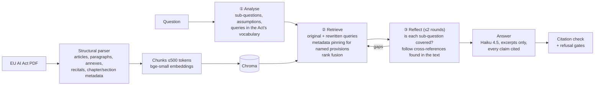

# EU AI Act Assistant

### Can an AI answer compliance questions *and* know when it doesn't know?

Picture a product manager asking:

> *"We're using AI to screen CVs. Does that make us high-risk under the EU AI Act?"*

The honest answer is spread across three places in a 144-page law:
- **Annex III** says recruitment tools are high-risk.
- **Article 6** explains what that classification means.
- **Article 26** lists what you now have to do.

A general chatbot answers confidently, and sometimes it cites the wrong article. In
compliance work, a confident wrong answer is worse than no answer.

So I set out to build an assistant that answers **only from the law itself** and cites
its source for every claim. It also had to refuse when the law doesn't cover the
question, without refusing when it does.

This repo is the whole journey. It's not just a RAG demo. It's how I'd run an AI feature
as a product manager: decide what "good" means before building, measure every change
against it, and don't ship on vibes.

---

## 🎯 The four KPIs, and the reasoning behind each

I defined these before writing the agent. Each one has a threshold, because a metric
without a target can't tell you whether to ship.

| KPI | Target | Shipped agent | |
|---|---|---|---|
| **Correctness**: does the answer match what the law says? | ≥ 0.90 | **0.93** (38/41) | ✅ |
| **Groundedness**: is every claim backed by the retrieved text? | ≥ 0.95 | **0.98** (40/41) | ✅ |
| **Correct refusals**: does it decline questions the Act doesn't cover? | 100% | **100%** (2/2) | ✅ |
| **Cost per question** | ≤ $0.03 | **$0.022** | ✅ |

**1. Correctness ≥ 0.90: the promise to the user.**
This is the reason the product exists. I set the bar at 0.90 for three reasons:
- At 9 in 10, a user will trust the assistant for first-pass research and check the
  citations on the answers that matter.
- Below that, they go back to reading the Act themselves.
- It's an achievable target. Giving the whole law to the most capable model scores
  0.98, so 0.90 isn't wishful. Basic RAG scored 0.73, so it isn't a given either.

On a 41-question test set, it means **no more than 4 wrong answers.**

**2. Groundedness ≥ 0.95: never invent.**
In compliance, an invented obligation is more dangerous than a missing one. The user
might act on it. The target isn't 1.00 for a practical reason: LLM judges wobble by 1–2
questions between runs. 0.95 allows at most 2 flagged answers, and **I review every
flagged answer by hand.** That's how the shipped figure went from 0.93 (judge only) to
0.98 (after review).

**3. Correct refusals = 100%: zero tolerance for bluffing.**
If someone asks about something the Act doesn't cover, the assistant must say so.
Bluffing even once destroys trust faster than any number of good answers builds it, so
this is a hard gate, not an average. It has a counterweight, tracked alongside it:
**wrongly refusing questions the Act *does* answer** (0 in the shipped version, down
from 10).

**4. Cost ≤ $0.03 per question: it has to be viable.**
At 3 cents a question, 1,000 questions a month costs about $30. That's cheap enough to
roll out internally without a budget conversation. The budget also stops quality from
being "solved" by throwing the biggest model at every question. The whole-law Opus
approach scores higher but costs $0.086, **so it fails this KPI.** That's why it's the
benchmark, not the product.

*All four are measured against a 41-question golden set I wrote by hand. There's more
on the evaluation system below.*

---

## 📖 How it got there

**Started simple.** Basic retrieval-augmented generation: find the most relevant
passages and let the model answer from them. It got **63%** right, and it refused about
1 in 4 questions it *could* have answered.

**The surprise.** I expected search to be the problem. It wasn't. The single biggest
issue was one cautious line in the prompt: *"when in doubt, refuse."* Rewriting it so the
model applies the law to the user's situation and names what's missing cut wrong
refusals **from 10 to 4**.

**Hit a wall.** I tried better search: keyword search, hybrid search, a reranker, bigger
embedding models and four ways of splitting the law into chunks. None of them beat the
noise. I set a margin *before* testing (a change must find ≥ 3 more sources out of 61),
and it stopped me shipping "wins" that were really luck.

**The real gap was vocabulary.** People say "CV screening", and the law says
"recruitment or selection of natural persons". So I made it **agentic**:
1. The model reads the question.
2. It rewrites the question into legal language and splits it into parts.
3. It searches.
4. It checks whether the evidence covers every part, and searches again where it
   doesn't.

The sources found went from **39 to 47 out of 61**.

**Then my own release gate blocked it.** The agent was more accurate, but it started
answering 2 questions I'd labelled "should refuse". I didn't ship it. On review, the Act
*does* answer those two questions (they're about its territorial scope), so I relabelled
them, re-ran everything from scratch, and fixed a separate bug. Only then did it pass.
I've kept that sequence visible in the [case study](docs/case-study.md), because
relabelling after a failure is exactly the kind of decision that should be questioned.

---

## ⚖️ Three ways to answer the same question

| | 💨 Basic RAG | 🧠 Agent (shipped) | 🔨 Whole law sent to Opus 5.5 |
|---|---|---|---|
| Correctness | 0.73 | **0.93** | 0.98 |
| Cost per question | **$0.005** | $0.022 | $0.086 |
| Time per answer | **5 s** | 15 s | 17 s |
| Best for | "What does Article 5 say?" | Real scenario questions | A few very high-stakes questions |

The agent gets within 2 questions of brute force for about a quarter of the price.

Its weak spot is **speed**. 15 seconds is fine for research, but too slow for inline help,
and that's the next thing to fix.

*The agent's scores include my review of flagged answers. The other two columns are
judge-only.*

---

## 💡 What I learned

- **A perfect metric can hide a bad product.** My first hand-scored run showed 100%
  groundedness, because a refusal can't invent anything. The product was refusing 1 in
  4 answerable questions.
- **Read the failures before tuning the system.** I spent effort on search when the
  biggest fix was one sentence in a prompt.
- **Write the ship rule before you see the results.** Otherwise every result looks like
  a reason to ship.
- **LLM judges wobble.** The same code scored 0.73 and 0.71 on two runs. One run isn't a
  trend, and a human needs to review what the judge flags.

The full story is in the **[case study](docs/case-study.md)**: every experiment, the
release gate, 11 failures and what they taught me, trade-offs and next steps. The
**[decision log](docs/decision-log.md)** covers each change as hypothesis → result →
decision.

---

## 🔧 Under the hood



- **Guardrails:** a fixed sequence, not an open-ended agent loop. There are at most 5
  LLM calls per question, and follow-up lookups happen only for provisions named in the
  retrieved text, never from the model's memory.
- **Models:** Claude Haiku 4.5 answers. Claude Sonnet 5 judges, a different model, so
  no model grades its own work. Both are called through OpenRouter.
- **Stack:** bge-small embeddings, Chroma, and LangSmith for tracing and evaluation.

**How it's evaluated:**
- **Judges:** three LLM judges score correctness, groundedness and relevance.
- **Human review:** my corrections are saved in
  [`evals/human_labels.json`](evals/human_labels.json), each with the lesson it
  teaches, and fed back into the judge prompts. The judge and I agree on 97% of scores.
- **Retrieval metrics:** computed by code, with no judge involved.
- **One command:** [`run_all_evals.py`](run_all_evals.py) runs the whole evaluation.

Metric definitions are in [docs/metrics.md](docs/metrics.md).

### Run it yourself

```bash
python -m venv venv && venv\Scripts\activate    # macOS/Linux: source venv/bin/activate
pip install -r requirements.txt
cp .env.example .env                              # add your OPENROUTER_API_KEY
```

Download the Act from EUR-Lex:
[Regulation (EU) 2024/1689](https://eur-lex.europa.eu/eli/reg/2024/1689/oj). Save it as
`data/eu_ai_act.pdf`. Then:

```bash
python ingest.py --reset          # build the index
python query.py                   # ask questions (agent)
python query.py --baseline        # ask questions (basic RAG)
python run_all_evals.py --system agentic --concurrency 2   # full eval, about $1 plus judging
```

### Repo map

| Path | What's there |
|---|---|
| [`docs/case-study.md`](docs/case-study.md) | The full product story |
| [`docs/decision-log.md`](docs/decision-log.md) | Every change: hypothesis, result, decision |
| [`docs/metrics.md`](docs/metrics.md) | How each metric is computed |
| [`docs/analysis/`](docs/analysis/) | Deep dives: retrieval options, run comparisons, the Opus 5.5 benchmark |
| [`plans/`](plans/) | The plan written before each change, with its results |
| `agent.py` | The agentic pipeline |
| `query.py`, `llm.py`, `provision_refs.py` | Basic RAG, refusal gates, answer generation |
| `ingest.py`, `chunking.py`, `embeddings.py` | PDF → structured chunks → index |
| `baseline_full_doc.py` | The whole-law Opus 5.5 benchmark |
| `evals/`, `run_all_evals.py`, `eval_retrieval.py` | Judges, human labels, golden set, results, retrieval metrics |
| `results/` | A spreadsheet for every evaluation run |

*Experiment IDs behind the numbers:*
- Agent: `35fe63c2`, human-reviewed
- Basic RAG: `ecfbeb79`
- Whole law sent to Opus 5.5: `f0d6b8ee`

Per-question results are in [`evals/results/`](evals/results/).
