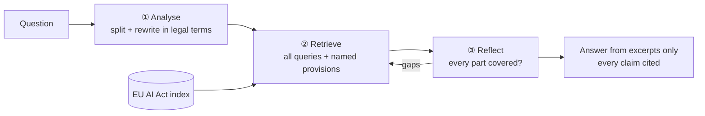

# EU AI Act Assistant

### Can an AI answer compliance questions *and* know when it doesn't know?

> *"We're using AI to screen CVs. Does that make us high-risk under the EU AI Act?"*

The answer is spread across Annex III, Article 6 and Article 26 of a 144-page law. A
general chatbot answers confidently, and sometimes it cites the wrong article. In
compliance, a confident wrong answer is worse than no answer.

So I built an assistant that answers **only from the law**, cites every claim, and
refuses when the law doesn't cover the question. I ran it like a real AI product: define
"good" first, measure every change, and never ship on vibes.


## 🎯 Four KPIs, in priority order

| KPI | Target | Shipped | Status | Why this bar |
|---|---|---|---|---|
| **1. Groundedness**: never invent | ≥ 0.95 | **0.98** | ✅ | An invented obligation is the most dangerous failure. |
| **2. Correct refusals**: don't bluff | 100% | **100%** | ✅ | Bluffing once destroys trust, so this is a hard gate. |
| **3. Correctness** | ≥ 0.90 | **0.93** | ✅ | Only counts once 1 and 2 hold. At 9 in 10, people trust it for research. |
| **4. Cost per question** | ≤ $0.03 | **$0.022** | ✅ | Keeps it viable, and stops me buying quality with the biggest model. |

*All four are scored on 41 hand-written test questions. LLM judges do the scoring, and I
review every answer they fail.*

## 📖 How it got there

- **Started simple.** Basic RAG got **63%** right, and it refused 1 in 4 questions it
  could have answered.
- **Went deep on chunking and retrieval**, which is where most of my time went. I split
  the law by its real structure, tagged chunks with their chapter and section, and
  looked up named articles directly.
- **Fixed a cautious prompt.** The line *"when in doubt, refuse"* was blocking good
  answers. Rewriting it cut wrong refusals **from 10 to 4**.
- **Made retrieval agentic.** People say "CV screening", and the law says "recruitment or
  selection of natural persons". The agent rewrites questions into legal terms, splits
  them into parts, and searches until every part is covered. Sources found rose **from
  39 to 47 out of 61**.
- **My own release gate blocked it** when it answered 2 "should refuse" questions. On
  review, the law does answer them, so I relabelled them and re-ran everything before
  shipping. The [case study](docs/case-study.md) tells the full story.

## ⚖️ Three ways to answer

| | 💨 Basic RAG (v1) | 🧠 Agent (shipped) | 🔨 Whole law sent to Opus 5.5 |
|---|---|---|---|
| 1. Groundedness | 1.00\* | **0.98** ✅ | 0.93 ❌ |
| 2. Correct refusals | 100% ✅ | 100% ✅ | 100% ✅ |
| 3. Correctness | 0.63 ❌ | 0.93 ✅ | **0.98** ✅ |
| 4. Cost per question | **$0.003** ✅ | $0.022 ✅ | $0.086 ❌ |
| Answerable questions wrongly refused | 11 of 37 | **0** | **0** |
| Time per answer | **4 s** | 15 s | 17 s |

Only the agent passes all four KPIs, and it does so at a quarter of Opus's cost. Its
weak spot is speed.

*Scoring: basic RAG by hand; the agent by LLM judge plus my review; Opus by LLM judge
only.*

## 💡 What I learned

- **Garbage in, garbage out.** With the same answering model throughout, better
  retrieval took correctness from 0.63 to 0.93. A stronger model can compensate, but at
  4× the cost.
- **A perfect metric can hide a bad product.** Groundedness was 100% while the assistant
  refused 1 in 4 answerable questions.
- **Write the ship rule before you see the results.**
- **LLM judges wobble.** One run isn't a trend, so a human reviews what they flag.

## 🚀 What I'd do next

1. **Build a web UI.** Clickable citations, visible assumptions and thumbs-up/down
   feedback.
2. **Test with real users.** Track the share of questions resolved without escalating to
   legal.
3. **Grow the test set** to 100+ questions, with at least 15 that should be refused.
   Today, only 2 are.
4. **Make it faster.** Get answers under 8 seconds, using parallel stages and a smaller
   model for the self-check.
5. **Stabilise the evaluation.** Average 3 runs per change, and run the eval
   automatically on every change.

## 🔧 Under the hood



**Stack:** Claude Haiku 4.5 answers, Claude Sonnet 5 judges, bge-small embeddings,
Chroma, and LangSmith.

**Limits:** at most 5 model calls per question.

```bash
pip install -r requirements.txt && cp .env.example .env   # add OPENROUTER_API_KEY
# save the Act (https://eur-lex.europa.eu/eli/reg/2024/1689/oj) as data/eu_ai_act.pdf
python ingest.py --reset      # build the index
python query.py               # ask questions (--baseline for basic RAG)
python run_all_evals.py --system agentic --concurrency 2   # full evaluation
```

**More:**
- [Case study](docs/case-study.md)
- [Decision log](docs/decision-log.md)
- [Metrics](docs/metrics.md)
- [Plans](plans/)
- [Results](evals/results/)

Runs behind the numbers: agent `35fe63c2`, basic RAG `afc59a56`, Opus `f0d6b8ee`.

## 👋 About me

I'm a product manager who builds. This project shows how I work: problem first, quality
defined before building, decisions written down.
📫 **[shrikumarsneha@gmail.com](mailto:shrikumarsneha@gmail.com)**
